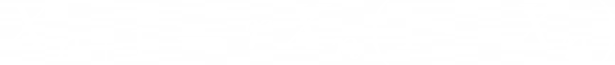
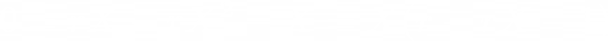
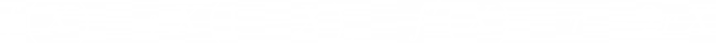
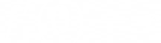
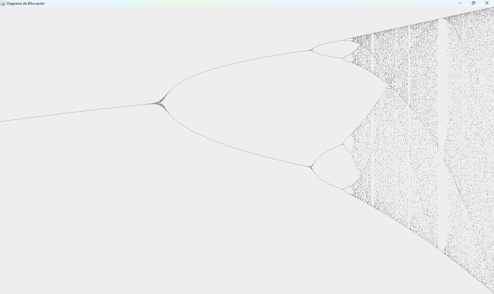

# 📘 Solución Taller: Explorando Sistemas Dinámicos y Bifurcaciones

✍️ **Autores:** Luigi Rincon, Samuel Moya, Juan Holguin

---

## 🔹 Parte Teórica

1. **¿Qué es un sistema dinámico?**  
   Un sistema dinámico es un modelo matemático que se encarga de estudiar la evolución de un sistema a través del tiempo.

2. **Diferencia entre:**
   - **Sistemas discretos y continuos:**  
     Los sistemas continuos tienen entradas y salidas continuas y sus variables cambian de forma pasiva con el tiempo, como en las ecuaciones diferenciales.  
     Los sistemas discretos cambian en pasos definidos o con variables específicas.

   - **Estabilidad y caos:**  
     Ambos siguen reglas deterministas, pero la diferencia radica en la predictibilidad.  
     En un sistema estable, el comportamiento futuro se puede predecir, mientras que en un sistema caótico no.

3. **Ejemplo real:**  
   El tráfico en una rotonda sin semáforos.

4. **Ecuación logística discreta:**

   

   - \( X_n \): Representa el crecimiento de la población u otra variable en el tiempo \( n \), entre 0 y 1.  
   - \( r \): Tasa de crecimiento.  
   - \( (1 - X_n) \): Representa los recursos limitados de \( X \).

5. **¿Qué pasa si \( r \) aumenta mucho?**  
   El sistema pasa de ser estable a oscilar, y finalmente entra en caos.

---

## 🔹 Análisis Matemático

1. **Ecuación logística:**

   

   Expansión:  
   

   Factorización:  
   

   **Puntos fijos:**  
   

2. **Derivada y estabilidad:**

   

   - En \(X_1 = 0\):  
       

     

   - En \(X_2 = 1 - 1/r\):  
       

     

3. **Interpretación:**  
   La relación que cumple con la notación de equilibrio en sistemas físicos o biológicos es la representación de una población o sistema que se mantiene en valores estables sin crecer indefinidamente ni extinguirse.

---

## 🔹 Programación y Exploración

- **\( r = 2.5 \):** El sistema empieza a oscilar alrededor de \( 0.6 \).  
- **\( r = 3.2 \):** El sistema oscila entre aproximadamente \( 0.5 \) y \( 0.8 \).  
- **\( r = 3.8 \):** El sistema entra en caos: en cada iteración los valores son totalmente diferentes y no hay un patrón visible.

---

## 🔹 Diagrama de Bifurcaciones

1. **¿Dónde aparecen los puntos de bifurcación?**  
   El primero aparece aproximadamente cuando \( r = 3 \).

2. **¿En qué intervalos aparece el caos?**  
   Cuando \( r \) se aproxima a 3.5.

3. **¿Qué significado real puede tener esto?**  
   Al aumentar la tasa de crecimiento \( r \), un sistema aparentemente ordenado se vuelve impredecible.  
   Ejemplo: en la economía, puede pasar de estable a tener fluctuaciones intensas por pequeños cambios en los parámetros.

 
---

## 🔹 Análisis Crítico

1. **¿Por qué sistemas deterministas pueden generar caos?**  
   Porque aunque la regla es fija, tienen una alta sensibilidad a las condiciones iniciales, lo que genera pequeñas diferencias que crecen con el tiempo, volviéndose impredecibles.

2. **Diferencias entre orden, caos y homeostasis:**
   - **Orden:** Comportamiento estable y predecible.  
   - **Caos:** Comportamiento irregular y sensible, sin patrones aparentes, impredecible.  
   - **Homeostasis:** Capacidad de un sistema de autorregularse o adaptarse para mantenerse estable frente a perturbaciones.

3. **Ejemplo real (grupo de WhatsApp y stickers):**
   - **Orden:** Con pocos stickers (bajo \( r \)), la conversación se mantiene tranquila.  
   - **Oscilación:** Con más stickers, el grupo entra en dinámicas repetitivas (ciclo de 2: un día todos responden, otro nadie).  
   - **Caos:** Si se exagera con los stickers (alto \( r \)), el grupo se vuelve incontrolable (300 mensajes en 5 minutos y luego silencio total).  

   - El “estado” \( X \) representa el nivel de actividad del grupo.  
   - \( r \) es la tasa de memes compartidos.

---

